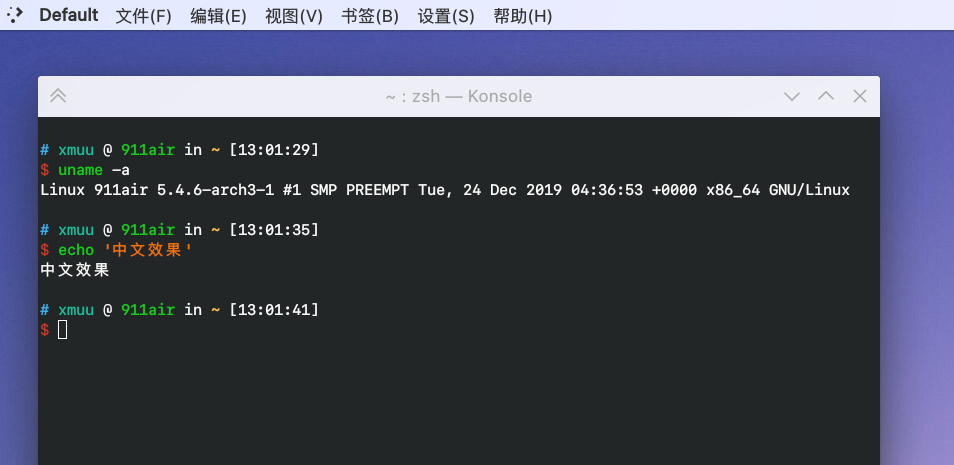
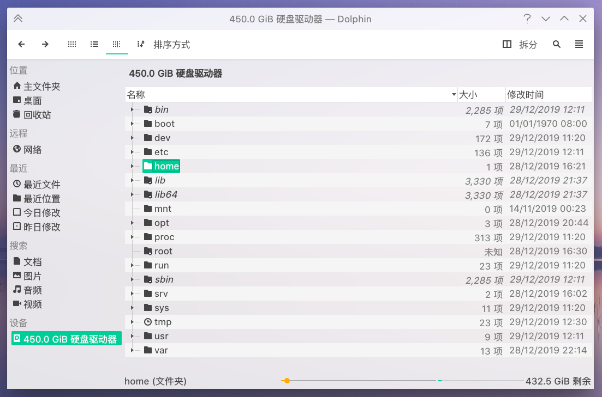
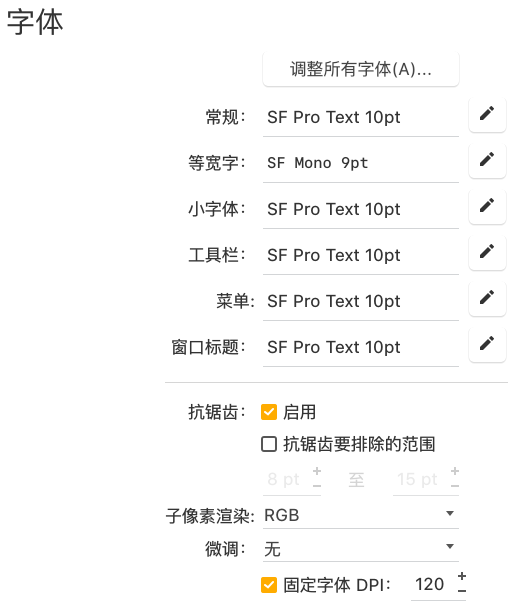
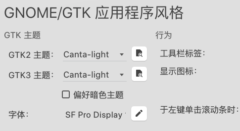

# arch-kde-fontconfig

## 说明

这是一套在 Linux 下使用来自 Apple 的 SF-Pro, SF-Mono, PingFang 字体的解决方案。所有字体均提取自 macOS 。
本配置仅在 Arch Linux 上， KDE 桌面环境下测试通过，其他发行版或者桌面环境请自行测试。

## 效果预览
    
    
    

## 使用方法

1. 'git clone' 到本地或者下载解压完成后，安装 SF-Pro, SF-Mono, PingFang 三个文件夹下的字体。
2. 复制 ’64-language-selector-prefer‘ 到目录 /etc/fonts/conf.avail/ 下。（如原本有同名文件请注意备份）
3. 'sudo ln -s /etc/fonts/conf.avail/64-language-selector-prefer.conf /etc/fonts/conf.d/64-language-selector-prefer.conf'
4. 'sudo fc-cache -fv'
5. 打开系统设置，找到字体设置，如图设置：
    
      
6. Reboot, enjoy.